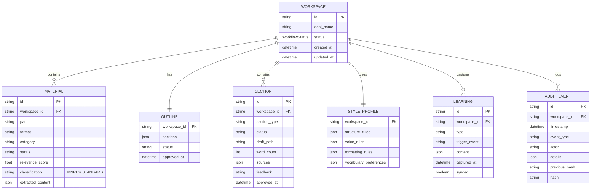

# AI Investment Memo Writing Assistant

## Enhancement Summary

**Deepened on:** 2026-01-28
**Research agents used:** 12 (agent-native-architecture, MCP best practices, TypeScript review, security-sentinel, architecture-strategist, code-simplicity-reviewer, performance-oracle, pattern-recognition-specialist, agent-native-reviewer, document-processing-researcher, dropbox-api-researcher, claude-code-plugin-docs)

### Key Improvements

1. **Dramatic Simplification**: Reduced from 10 specialized agents to 1 configurable section writer, eliminating shotgun surgery anti-pattern
2. **Security Hardening**: Added MNPI handling protocol, secure credential management, audit logging, and secure deletion requirements
3. **Pure Python Architecture**: Consolidated to Python-only MCP server for document processing (eliminating TypeScript/Python boundary issues)
4. **Agent-Native Compliance**: Added 13 MCP tools for checkpoint actions so agents can perform the same actions as humans
5. **Performance Optimization**: Added parallel document processing, context window management, and caching strategies

### Critical Security Additions

- **MNPI Protocol**: Material Non-Public Information handling requirements
- **Credential Vault**: Secure credential storage with encryption at rest
- **Audit Logging**: Immutable logging for compliance
- **Secure Deletion**: Cryptographic erasure for ephemeral processing

### Architecture Simplifications

- 10 section agents → 1 configurable `section-writer` agent
- 4 commands → 1 command (`/memo`) with subcommands
- 3 skills → 1 skill (`memo-workflow`)
- Mixed TypeScript/Python → Pure Python MCP server

---

## Overview

Build a Claude Code plugin that assists investment analysts in creating professional investment memos by ingesting dataroom materials, proposing relevant content, and drafting sections through specialized AI agents—all while learning from past memos to maintain consistent style and structure.

## Problem Statement / Motivation

Investment analysts spend significant time manually reviewing dataroom materials, organizing information, and writing investment memos. This process is:

1. **Time-consuming**: Reviewing hundreds of documents and synthesizing into coherent memos takes days
2. **Inconsistent**: Different analysts produce memos with varying quality, structure, and depth
3. **Error-prone**: Important information can be missed across large document sets
4. **Not compounding**: Lessons learned on one memo don't systematically improve the next

An AI-assisted tool can accelerate this process while maintaining quality through human oversight at every critical decision point.

## Proposed Solution

A **Claude Code plugin** (`memo-agent`) that orchestrates the memo creation workflow through:

1. **Dropbox MCP integration** for dataroom material access
2. **Single configurable section writer** with specialized prompts for each section type
3. **Human-in-the-loop checkpoints** at material selection, outline approval, and each section
4. **Template learning** from past memos to match style, tone, and structure
5. **Knowledge compounding** through documented learnings that improve future memos

### Why a Claude Code Plugin?

| Approach | Pros | Cons |
|----------|------|------|
| **Claude Code Plugin** | Leverages existing CLI, easy iteration, local file access, integrates with compound-engineering patterns | Users need CLI familiarity (mitigated by skill design) |
| Web Application | Browser-based, no installation | Requires infrastructure, more complex deployment |
| Standalone Agent | Complete control | Builds from scratch, loses Claude Code ecosystem |

**Decision: Claude Code Plugin** - The plugin architecture provides:
- MCP server integration (Dropbox, Context7)
- Existing agent/skill/command patterns from compound-engineering
- Local file system access for workspace and output
- Extensibility through the plugin ecosystem

### Research Insights: Plugin Architecture

**Best Practices (from Claude Code plugin docs):**
- Use `SKILL.md` files with YAML frontmatter for allowed-tools restrictions
- Commands should be thin wrappers that invoke skills
- Agents are for complex multi-step reasoning; skills for workflows
- Register MCP servers in `.mcp.json` at plugin root

**Performance Considerations:**
- Lazy-load MCP servers (only start when first tool is called)
- Use `model: haiku` for simple agents (style checking) to reduce latency
- Prefer streaming responses for long-running operations

**Edge Cases:**
- Plugin may not be loaded if `.claude-plugin/plugin.json` is malformed
- MCP server crashes should not crash the plugin - implement health checks
- Handle `SIGTERM` gracefully for session persistence

## Architecture

### High-Level System Design (Simplified)

```
┌─────────────────────────────────────────────────────────────────────┐
│                        CLAUDE CODE PLUGIN                           │
│                          (memo-agent)                               │
├─────────────────────────────────────────────────────────────────────┤
│                                                                     │
│  ┌─────────────┐    ┌─────────────┐    ┌─────────────┐            │
│  │  COMMAND    │    │   SKILL     │    │   AGENT     │            │
│  │             │    │             │    │             │            │
│  │ /memo       │───→│ memo-       │───→│ section-    │            │
│  │   :start    │    │ workflow    │    │ writer      │            │
│  │   :status   │    │             │    │             │            │
│  │   :resume   │    │ (orchestrates    │ (configurable            │
│  │   :export   │    │  full flow)      │  per section)            │
│  └─────────────┘    └─────────────┘    │             │            │
│                                        │ style-      │            │
│                                        │ guardian    │            │
│                                        └─────────────┘            │
│                                                                     │
├─────────────────────────────────────────────────────────────────────┤
│                         MCP SERVERS                                 │
│  ┌─────────────────────┐    ┌─────────────────────────────────┐   │
│  │  ngs/dropbox-mcp    │    │  memo-document-processor        │   │
│  │  (community server) │    │  (Pure Python - pdfplumber,     │   │
│  │                     │    │   pymupdf4llm, python-docx)     │   │
│  └─────────────────────┘    └─────────────────────────────────┘   │
└─────────────────────────────────────────────────────────────────────┘
                              │
                              ▼
┌─────────────────────────────────────────────────────────────────────┐
│                      SHARED WORKSPACE                               │
│                                                                     │
│  project/                                                           │
│  ├── .memo-workspace/                                               │
│  │   ├── state.json            # Session state (state machine)     │
│  │   ├── materials/            # Extracted content                 │
│  │   │   ├── manifest.json     # Document inventory                │
│  │   │   └── extracted/        # Processed content per doc         │
│  │   ├── outline.md            # Approved outline                  │
│  │   ├── sections/             # Draft sections                    │
│  │   │   ├── 01-deal-summary.md                                    │
│  │   │   └── ...                                                   │
│  │   ├── style-guide.md        # Extracted style rules             │
│  │   ├── context/              # Shared context for agents         │
│  │   │   ├── key-facts.md      # Cross-referenced facts            │
│  │   │   └── decisions.md      # User decisions log                │
│  │   └── audit.log             # Immutable audit trail             │
│  ├── templates/                # Past memos for learning           │
│  ├── output/                   # Generated Word documents          │
│  └── docs/                                                         │
│      └── solutions/            # Compounded learnings              │
└─────────────────────────────────────────────────────────────────────┘
```

### Research Insights: Architecture

**Best Practices:**
- Use a shared workspace directory (`.memo-workspace/`) as the source of truth
- State machine pattern for workflow status with explicit transitions
- Agents should be outcome-driven, not task-driven ("draft a compelling strengths section" not "call these tools")

**Anti-Pattern Identified: Shotgun Surgery**
The original design with 10 separate section agents creates a "shotgun surgery" anti-pattern where changes to section writing logic require updates to 10 files.

**Solution: Single Configurable Section Writer**
```
section-writer agent
├── Reads section config from outline.md
├── Loads section-specific prompts from config
├── Uses same writing workflow for all sections
└── Specialization via configuration, not code duplication
```

**Performance Considerations:**
- Parallel document extraction (process 5-10 documents concurrently)
- Hierarchical summarization for large documents (>50 pages)
- Cache extracted content with content-hash keys

### Multi-Agent Orchestration (Simplified)

```
┌────────────────────────────────────────────────────┐
│              memo-workflow SKILL                    │
│                                                    │
│  Orchestrates the full memo creation flow:         │
│  1. Material ingestion & selection                 │
│  2. Style learning from templates                  │
│  3. Outline generation & approval                  │
│  4. Section drafting (calls section-writer)        │
│  5. Style guardian review                          │
│  6. Export & learning capture                      │
└────────────────────────────┬───────────────────────┘
                             │
         ┌───────────────────┼───────────────────┐
         │                   │                   │
         ▼                   ▼                   ▼
┌─────────────────┐ ┌─────────────────┐ ┌─────────────────┐
│ section-writer  │ │ section-writer  │ │ section-writer  │
│ (Deal Summary)  │ │ (Strengths)     │ │ (Risks)         │
│                 │ │                 │ │                 │
│ Same agent,     │ │ Config-driven   │ │ Specialized via │
│ different       │ │ specialization  │ │ prompts, not    │
│ config/prompts  │ │                 │ │ separate agents │
└────────┬────────┘ └────────┬────────┘ └────────┬────────┘
         │                   │                   │
         └───────────────────┼───────────────────┘
                             ▼
                   ┌─────────────────┐
                   │ style-guardian  │
                   │                 │
                   │ Haiku model for │
                   │ fast, cheap     │
                   │ consistency     │
                   │ checks          │
                   └─────────────────┘
```

### Memo Sections (Standard Structure)

| Section | Config Key | Description |
|---------|------------|-------------|
| **Deal Summary** | `deal-summary` | Executive overview, key terms, transaction structure |
| **Investment Strengths** | `strengths` | Growth drivers, competitive moat, thesis support |
| **Risk Factors** | `risks` | Key risks and mitigations |
| **Company Analysis** | `company` | Business model, products, history |
| **Market Analysis** | `market` | TAM, competition, industry trends |
| **Financial Analysis** | `financials` | Historical performance, projections, unit economics |
| **Underwriter Scenarios** | `scenarios` | Bull/base/bear cases with assumptions |
| **Security Analysis** | `security` | Cap table, terms, valuation |
| **Management Overview** | `management` | Team backgrounds, track record |
| **Board of Directors** | `board` | Board composition and governance |

### Human-in-the-Loop Flow

```
START
  │
  ▼
┌─────────────────────────────────────────┐
│  1. MATERIAL SELECTION CHECKPOINT       │
│                                         │
│  AI proposes materials + rationale      │
│  User: ✓ Approve / ✗ Reject / ✎ Edit    │
│                                         │
│  MCP Tools for agent-native access:     │
│  - approve_materials()                  │
│  - reject_material(id)                  │
│  - include_material(id)                 │
└───────────────────┬─────────────────────┘
                    │
                    ▼
┌─────────────────────────────────────────┐
│  2. OUTLINE CHECKPOINT                  │
│                                         │
│  AI proposes memo structure             │
│  User: ✓ Approve / ✗ Reject / ✎ Reorder │
│                                         │
│  MCP Tools for agent-native access:     │
│  - approve_outline()                    │
│  - reorder_section(id, position)        │
│  - add_section(name)                    │
│  - remove_section(id)                   │
└───────────────────┬─────────────────────┘
                    │
                    ▼
┌─────────────────────────────────────────┐
│  3. SECTION DRAFTING (per section)      │
│                                         │
│  section-writer drafts section          │
│  Style Guardian reviews                 │
│  User: ✓ Approve / ✗ Reject / ✎ Edit    │
│                                         │
│  MCP Tools for agent-native access:     │
│  - approve_section(id)                  │
│  - reject_section(id, feedback)         │
│  - edit_section(id, content)            │
│  - regenerate_section(id, feedback)     │
└───────────────────┬─────────────────────┘
                    │
                    ▼
┌─────────────────────────────────────────┐
│  4. FINAL REVIEW & EXPORT               │
│                                         │
│  Assembled preview                      │
│  Generate Word document                 │
│  Capture learnings                      │
│                                         │
│  MCP Tools for agent-native access:     │
│  - export_memo(format)                  │
│  - capture_learning(type, content)      │
└─────────────────────────────────────────┘
```

### Research Insights: Agent-Native Checkpoints

**Critical Finding:** The original design had text-based commands ("type 'approve'") that are not agent-accessible. Agents need MCP tools to perform the same actions as humans.

**Required MCP Tools for Checkpoint Actions:**

```python
# These tools make the workflow agent-native
@server.tool()
def approve_materials(workspace_id: str) -> dict:
    """Approve all proposed materials and advance to outline stage"""

@server.tool()
def reject_material(workspace_id: str, material_id: str, reason: str) -> dict:
    """Reject a specific material with reason"""

@server.tool()
def approve_outline(workspace_id: str) -> dict:
    """Approve the proposed outline and advance to drafting"""

@server.tool()
def approve_section(workspace_id: str, section_id: str) -> dict:
    """Approve a section draft and advance to next section"""

@server.tool()
def regenerate_section(workspace_id: str, section_id: str, feedback: str) -> dict:
    """Request section regeneration with specific feedback"""

@server.tool()
def get_checkpoint_status(workspace_id: str) -> dict:
    """Get current checkpoint state, pending actions, and available commands"""
```

**Agent-Native Principle:** Any action a user can take, an agent must also be able to take via tools.

## Technical Approach

### Phase 1: Foundation (Core Infrastructure)

**Goal:** Establish plugin structure, MCP integrations, and workspace management.

#### 1.1 Plugin Scaffold (Simplified)

Create the base plugin structure following Claude Code conventions:

```
memo-agent/
├── .claude-plugin/
│   └── plugin.json
├── .mcp.json
├── commands/
│   └── memo.md                     # Single command with subcommands
├── skills/
│   └── memo-workflow/
│       ├── SKILL.md
│       └── section-configs/        # Per-section prompts
│           ├── deal-summary.md
│           ├── strengths.md
│           ├── risks.md
│           └── ...
├── agents/
│   ├── section-writer.md           # Single configurable agent
│   └── style-guardian.md
├── servers/
│   └── memo-processor/             # Pure Python MCP server
│       ├── pyproject.toml
│       └── src/
│           └── memo_processor/
│               ├── __init__.py
│               ├── server.py
│               ├── extractors/
│               │   ├── pdf.py
│               │   ├── word.py
│               │   ├── excel.py
│               │   └── image.py
│               ├── generators/
│               │   └── docx.py
│               └── checkpoint_tools.py
├── templates/
│   └── memo-template.docx
├── docs/
│   ├── solutions/
│   └── style-guide.md
├── CLAUDE.md
└── README.md
```

### Research Insights: Simplification

**Original Plan:** 4 commands, 3 skills, 12 agents, 2 MCP servers
**Recommended:** 1 command, 1 skill, 2 agents, 1 MCP server

**Why Simpler is Better:**
- Fewer moving parts = fewer failure modes
- Single skill orchestrates full workflow = easier debugging
- One configurable agent = one place to improve section writing
- Pure Python MCP = no TypeScript/Python boundary issues

#### 1.2 Dropbox MCP Integration

**Important Discovery:** There is no official Anthropic Dropbox MCP server. Use the community server:

```json
// .mcp.json
{
  "dropbox": {
    "type": "stdio",
    "command": "npx",
    "args": ["-y", "dropbox-mcp-server"],
    "env": {
      "DROPBOX_ACCESS_TOKEN": "${DROPBOX_ACCESS_TOKEN}"
    }
  }
}
```

**Source:** `ngs/dropbox-mcp-server` (community-maintained)

**Dropbox Integration Contract:**
- Read-only access to dataroom folder
- Expected structure: `/Datarooms/{DealName}/` containing all materials
- Supported formats: PDF, DOCX, XLSX, PPTX, PNG, JPG, EML, TXT

### Research Insights: Dropbox API

**Best Practices:**
- Use OAuth 2.0 with refresh tokens (not long-lived access tokens)
- Store refresh tokens securely (see Security section)
- Implement exponential backoff for rate limits (429 responses)
- Use `/files/download` for small files, `/files/download_zip` for batch downloads

**Edge Cases:**
- Handle shared folder permissions (user may have read but not list access)
- Large files (>150MB) require chunked download
- Paper docs require conversion before processing

**Performance:**
- Batch list operations with `/files/list_folder/continue`
- Cache folder listings for 5 minutes (datarooms don't change frequently)

#### 1.3 Document Processing MCP Server (Pure Python)

**Rationale for Pure Python:** The original plan mixed TypeScript and Python. This creates:
- Subprocess management complexity
- Error handling across language boundaries
- Two dependency systems to maintain

**Solution:** Pure Python MCP server using FastMCP or mcp-python-sdk.

```python
# servers/memo-processor/src/memo_processor/server.py
from mcp.server import Server
from mcp.types import Tool, TextContent
import pdfplumber
import pymupdf4llm
from docx import Document
import openpyxl

server = Server("memo-document-processor")

@server.tool()
async def extract_document(path: str, format: str) -> dict:
    """Extract text, tables, and metadata from a document.

    Args:
        path: Path to the document file
        format: One of 'pdf', 'docx', 'xlsx', 'pptx', 'image', 'email'

    Returns:
        Extracted content with structure preserved
    """
    match format:
        case 'pdf':
            return await extract_pdf(path)
        case 'docx':
            return await extract_word(path)
        case 'xlsx':
            return await extract_excel(path)
        case 'pptx':
            return await extract_powerpoint(path)
        case 'image':
            return await extract_image_ocr(path)
        case 'email':
            return await extract_email(path)
        case _:
            raise ValueError(f"Unsupported format: {format}")

@server.tool()
async def generate_word_document(
    sections: list[dict],
    template_path: str | None,
    output_path: str
) -> dict:
    """Generate a Word document from markdown sections.

    Args:
        sections: List of {title: str, content: str} objects
        template_path: Optional path to template .docx for styling
        output_path: Where to save the generated document

    Returns:
        Path to generated document and metadata
    """
    return await generate_docx(sections, template_path, output_path)

# Checkpoint action tools (agent-native)
@server.tool()
async def approve_materials(workspace_id: str) -> dict:
    """Approve proposed materials and advance to outline stage."""
    return await advance_checkpoint(workspace_id, 'materials', 'approved')

@server.tool()
async def approve_section(workspace_id: str, section_id: str) -> dict:
    """Approve a section draft."""
    return await advance_checkpoint(workspace_id, f'section:{section_id}', 'approved')

@server.tool()
async def get_checkpoint_status(workspace_id: str) -> dict:
    """Get current workflow state and available actions."""
    return await get_workspace_state(workspace_id)
```

### Research Insights: Document Processing

**PDF Extraction - Tool Selection:**

| Tool | Best For | Limitations |
|------|----------|-------------|
| **pdfplumber** | Tables, structured data | Slower, no OCR |
| **PyMuPDF4LLM** | LLM-ready markdown output | Less accurate tables |
| **Docling** | Complex layouts, OCR | Heavier dependencies |
| **marker** | Scientific papers | Overkill for business docs |

**Recommendation:** Use **pdfplumber** for table-heavy documents (financial statements), **PyMuPDF4LLM** for narrative documents (pitch decks).

```python
async def extract_pdf(path: str) -> dict:
    """Smart PDF extraction based on content type."""
    # First pass: detect if document is table-heavy
    with pdfplumber.open(path) as pdf:
        first_page = pdf.pages[0]
        tables = first_page.extract_tables()

    if len(tables) > 2:
        # Table-heavy: use pdfplumber
        return await extract_pdf_pdfplumber(path)
    else:
        # Narrative: use PyMuPDF4LLM
        return await extract_pdf_pymupdf4llm(path)
```

**Excel Processing:**
- Use `openpyxl` for .xlsx files
- Handle merged cells by propagating values
- Detect header rows heuristically
- Convert to markdown tables for LLM consumption

**Word Processing:**
- Use `python-docx` for reading
- Preserve heading hierarchy
- Extract embedded images for OCR if needed

#### 1.4 Workspace Management

```python
# Workspace state schema with explicit state machine
from enum import Enum
from pydantic import BaseModel
from datetime import datetime

class WorkflowStatus(str, Enum):
    MATERIAL_SELECTION = "material-selection"
    OUTLINE = "outline"
    DRAFTING = "drafting"
    REVIEW = "review"
    COMPLETE = "complete"

# Valid state transitions
VALID_TRANSITIONS = {
    WorkflowStatus.MATERIAL_SELECTION: [WorkflowStatus.OUTLINE],
    WorkflowStatus.OUTLINE: [WorkflowStatus.DRAFTING, WorkflowStatus.MATERIAL_SELECTION],
    WorkflowStatus.DRAFTING: [WorkflowStatus.REVIEW, WorkflowStatus.DRAFTING],
    WorkflowStatus.REVIEW: [WorkflowStatus.COMPLETE, WorkflowStatus.DRAFTING],
    WorkflowStatus.COMPLETE: [],
}

class MemoWorkspace(BaseModel):
    version: str = "1.0.0"
    deal_name: str
    created_at: datetime
    status: WorkflowStatus
    current_section: str | None = None
    materials: MaterialSet
    outline: list[OutlineSection] = []
    sections: dict[str, SectionState] = {}
    style_profile: StyleProfile | None = None
    learnings: list[Learning] = []

    def transition_to(self, new_status: WorkflowStatus) -> None:
        """Transition to new status with validation."""
        if new_status not in VALID_TRANSITIONS[self.status]:
            raise InvalidTransitionError(
                f"Cannot transition from {self.status} to {new_status}"
            )
        self.status = new_status
```

### Research Insights: State Machine

**Best Practices:**
- Explicit state machine with validated transitions
- Log all transitions to audit trail
- Store state as JSON for human readability and debugging
- Use file locking or atomic writes to prevent corruption

**Edge Cases:**
- User closes terminal mid-transition → state should be recoverable
- Multiple sessions on same workspace → implement locking
- State file corruption → keep backup of last valid state

### Phase 2: Material Ingestion & Selection

**Goal:** Ingest dataroom materials, extract content, and propose relevant materials.

#### 2.1 Document Ingestion Workflow

```markdown
---
name: memo-workflow
description: Orchestrate the full investment memo creation workflow
allowed-tools:
  - mcp__dropbox__list_folder
  - mcp__dropbox__download
  - mcp__memo-processor__extract_document
  - mcp__memo-processor__generate_word_document
  - mcp__memo-processor__approve_materials
  - mcp__memo-processor__approve_outline
  - mcp__memo-processor__approve_section
  - mcp__memo-processor__get_checkpoint_status
  - Read
  - Write
  - Task
---

# memo-workflow Skill

## Overview

This skill orchestrates the complete investment memo creation workflow from
material ingestion through final export.

## Workflow Phases

### Phase 1: Material Ingestion

1. List all files in Dropbox dataroom folder
2. Download files to local workspace
3. Classify each document by type and potential relevance
4. Extract content and structure using appropriate extractor
5. Create manifest with metadata and extracted content references
6. Propose material selection to user

### Phase 2: Style Learning

1. Read provided template memos from templates/
2. Analyze and extract style patterns
3. Generate style-guide.md with extracted rules

### Phase 3: Outline Generation

1. Based on available materials and style guide
2. Propose outline structure
3. Get user approval via checkpoint

### Phase 4: Section Drafting

For each section in approved outline:
1. Spawn section-writer agent with section config
2. Collect draft
3. Run style-guardian review
4. Present to user for approval via checkpoint

### Phase 5: Export

1. Assemble all approved sections
2. Run final consistency check
3. Generate Word document from template
4. Capture learnings

## Material Classification Categories

- **Financial**: Cap tables, financial models, historical statements
- **Legal**: Term sheets, LOIs, corporate documents
- **Business**: Pitch decks, business plans, product docs
- **Market**: Industry reports, competitor analysis
- **Team**: Bios, org charts, references
- **Other**: Meeting notes, emails, transcripts
```

### Research Insights: Material Ingestion

**Performance: Parallel Processing**

```python
import asyncio
from concurrent.futures import ThreadPoolExecutor

async def ingest_materials(workspace: MemoWorkspace, files: list[str]) -> None:
    """Process documents in parallel batches."""
    BATCH_SIZE = 5  # Tune based on memory/CPU

    for batch in chunked(files, BATCH_SIZE):
        tasks = [extract_document(f) for f in batch]
        results = await asyncio.gather(*tasks, return_exceptions=True)

        for file, result in zip(batch, results):
            if isinstance(result, Exception):
                log_extraction_error(file, result)
            else:
                workspace.materials.add(file, result)
```

**Context Window Management:**

For large documents (>50 pages), use hierarchical summarization:

```python
async def extract_large_document(path: str) -> dict:
    """Extract with hierarchical summarization for large docs."""
    full_content = await extract_pdf(path)

    if full_content['page_count'] > 50:
        # Summarize each section
        summaries = []
        for section in full_content['sections']:
            summary = await summarize_section(section)
            summaries.append(summary)

        # Return both full content (for reference) and summaries (for context)
        return {
            'full_content_path': save_to_workspace(full_content),
            'summaries': summaries,
            'key_facts': extract_key_facts(full_content),
        }

    return full_content
```

#### 2.2 Material Selection Checkpoint

The skill presents materials grouped by category:

```markdown
## Proposed Materials for [Deal Name] Memo

### Financial (5 documents) - Recommended for all sections
| Document | Type | Relevance | Proposed Sections |
|----------|------|-----------|-------------------|
| Financial Model v3.xlsx | Excel | High | Financials, Scenarios |
| Cap Table 2025.xlsx | Excel | High | Security Analysis |
| Historical Financials.pdf | PDF | High | Financials |

[✓] Include all Financial documents

### Market Analysis (3 documents) - Recommended for Market section
...

### Not Recommended (2 documents)
| Document | Reason |
|----------|--------|
| Draft Notes v1.docx | Superseded by v2 |
| Image001.png | Low resolution screenshot |

---
**Actions available (use MCP tools or text commands):**
- `approve` or call `approve_materials()` - proceed with recommended materials
- `include [filename]` or call `include_material(id)` - add excluded documents
- `exclude [filename]` or call `reject_material(id)` - remove recommended documents
```

### Phase 3: Style Learning & Outline

**Goal:** Learn from past memos and propose outline structure.

#### 3.1 Style Learning

```markdown
# Style Learning Process

1. Read provided template memos from templates/
2. Analyze and extract:
   - Section structure and ordering
   - Typical section lengths
   - Vocabulary and terminology preferences
   - Sentence structure patterns
   - Formatting conventions (headers, bullets, tables)
   - Tone (formal/casual, cautious/confident)
3. Generate style-guide.md with extracted rules

## Style Guide Output Format

```markdown
# Style Guide for [Firm] Investment Memos

## Structure
- Standard sections: [list]
- Section order: [order]
- Executive summary length: [range]

## Voice & Tone
- Perspective: Third person objective
- Formality: Professional, avoid jargon
- Confidence level: Measured, evidence-based

## Formatting
- Headers: Title case
- Numbers: Spell out 1-9, numerals for 10+
- Currency: $X.XM format
- Percentages: X.X% with one decimal

## Vocabulary Preferences
- Use "opportunity" over "potential"
- Use "concerns" over "risks" for minor issues
- Avoid: "significant", "substantial" (overused)

## Section-Specific Guidance
### Deal Summary
- Lead with transaction terms
- Include key metrics upfront
- Length: 300-500 words
...
```

#### 3.2 Outline Generation

Coordinator proposes outline based on:
- Standard memo structure
- Material availability (skip sections without supporting materials)
- Style guide preferences
- User's historical patterns

```markdown
## Proposed Memo Outline: [Deal Name]

### Required Sections
1. **Deal Summary** - Transaction overview and key terms
   - Supporting materials: Term Sheet, Pitch Deck
   - Estimated length: 400-500 words

2. **Investment Strengths** - Why this is compelling
   - Supporting materials: Business Plan, Market Report
   - Estimated length: 600-800 words

3. **Risk Factors** - Key concerns and mitigations
   - Supporting materials: Due Diligence Report, Financial Model
   - Estimated length: 500-700 words

### Optional Sections (based on available materials)
4. **Management Overview** - Team backgrounds
   - ⚠️ Limited materials available (only bios)
   - [ ] Include / [ ] Skip

---
**Actions available (use MCP tools or text commands):**
- `approve` or call `approve_outline()` - proceed with this outline
- `reorder [section] [position]` or call `reorder_section(id, pos)` - change order
- `add [section name]` or call `add_section(name)` - add a custom section
- `remove [section]` or call `remove_section(id)` - exclude a section
```

### Phase 4: Section Drafting

**Goal:** Draft each section with the configurable section-writer agent.

#### 4.1 Section Writer Agent (Configurable)

```markdown
---
name: section-writer
description: Draft memo sections using section-specific configuration
model: sonnet
---

# Section Writer Agent

## Your Role

You are an expert investment memo writer. You draft individual sections
based on the configuration provided, source materials, and style guide.

## Inputs

1. **Section Config**: Loaded from skills/memo-workflow/section-configs/{section-type}.md
2. **Style Guide**: .memo-workspace/style-guide.md
3. **Key Facts**: .memo-workspace/context/key-facts.md
4. **Prior Sections**: .memo-workspace/sections/*.md (for consistency)
5. **Source Materials**: Paths specified in outline for this section

## Process

1. Read the section config for your section type
2. Read the style guide and match voice/tone exactly
3. Review key facts to ensure consistency with other sections
4. Read relevant source materials thoroughly
5. Draft section following structure guidelines
6. Include citations for all factual claims: [Source: filename, page X]
7. Target the word count specified in config

## Output Format

Write markdown to: .memo-workspace/sections/{section-id}.md

Include YAML frontmatter:
```yaml
---
section: {section-type}
status: draft
word_count: {count}
sources:
  - document: {filename}
    pages: [1, 2, 5]
confidence: high|medium|low
low_confidence_areas:
  - {specific area where more info needed}
---
```
```

#### 4.2 Section Configuration Example

```markdown
# skills/memo-workflow/section-configs/strengths.md

---
section_type: strengths
display_name: Investment Strengths
order: 2
word_count_target: 600-800
---

# Investment Strengths Section Configuration

## Purpose

Articulate why this investment is compelling. Focus on growth drivers,
competitive advantages, and thesis support.

## Structure

1. **Opening**: One sentence capturing the core investment thesis
2. **Key Strengths**: 3-5 bullet points, each with supporting evidence
3. **Competitive Position**: How the company wins against alternatives
4. **Growth Catalysts**: What will drive future performance

## What to Include

- Market opportunity and timing
- Product/technology differentiation
- Team and execution capability
- Financial momentum (if positive)
- Strategic partnerships or customers

## What to Avoid

- Repeating deal terms (that's Deal Summary)
- Detailed financials (that's Financial Analysis)
- Risks (save for Risk Factors section)
- Unsubstantiated claims

## Tone Guidance

- Confident but measured
- Evidence-based, cite sources
- Avoid superlatives without support

## Example Opening Lines

- "Acme represents an opportunity to invest in the leading [X] platform at an attractive entry point."
- "The investment thesis centers on three core strengths: [A], [B], and [C]."
```

#### 4.3 Context Sharing Strategy

To maintain coherence while respecting token limits:

1. **Key Facts Document**: Shared document with critical facts all agents must reference
   ```markdown
   # Key Facts - [Deal Name]

   ## Company Basics
   - Founded: 2019
   - HQ: San Francisco, CA
   - Employees: 150

   ## Transaction
   - Round: Series B
   - Amount: $50M
   - Valuation: $200M post

   ## Financials
   - 2024 Revenue: $12M
   - 2024 Burn: $800K/month
   - Runway: 18 months

   ## Key Metrics
   - ARR: $14.4M
   - Growth: 150% YoY
   - NDR: 125%
   ```

2. **Section Summaries**: Each completed section generates a summary for subsequent agents
   ```markdown
   ## Deal Summary - Key Points for Other Sections
   - Transaction characterized as "growth investment"
   - Positioned company as "market leader in X"
   - Used cautious language re: projections
   ```

3. **Style Guardian Enforcement**: Runs after each section to ensure consistency

#### 4.4 Section Checkpoint UX

```markdown
## Section Draft: Investment Strengths

**Word Count:** 723 | **Target:** 600-800 | **Confidence:** High

---

[Draft content here with inline citations]

---

### Sources Referenced
- Pitch Deck Q4 2025.pdf (pages 12-18)
- Market Analysis Report.pdf (pages 5-8)
- Financial Model v3.xlsx (Revenue tab)

### Areas of Lower Confidence
- Market size figures from 2023 report - may be outdated

---
**Actions available (use MCP tools or text commands):**
- `approve` or call `approve_section(section_id)` - finalize this section
- `edit` - make inline changes (opens in editor)
- `regenerate: [feedback]` or call `regenerate_section(id, feedback)` - request rewrite
- `sources` - view relevant source excerpts
```

### Phase 5: Final Assembly & Export

**Goal:** Assemble sections, run final review, and generate Word document.

#### 5.1 Style Guardian Final Pass

```markdown
---
name: style-guardian
description: Review memo sections for consistency in voice, terminology, and formatting
model: haiku
---

# Style Guardian Agent

## Your Role

You are the final quality gate ensuring all memo sections read as if written
by the same author. Use haiku model for fast, cheap consistency checks.

## Consistency Checks

1. **Terminology**: Same terms used throughout (e.g., always "revenue" not sometimes "sales")
2. **Numbers**: Consistent formatting ($X.XM, X.X%, dates)
3. **Company references**: Consistent naming ("the Company", "Acme", etc.)
4. **Tone**: No jarring shifts between sections
5. **Cross-references**: Sections reference each other accurately

## Output

```markdown
## Style Review Report

### Consistency Score: X/5

### Issues Found
1. **Line 45 (Financials)**: Uses "sales" but Deal Summary uses "revenue"
   - Suggestion: Change to "revenue" for consistency

2. **Line 112 (Risks)**: Tone shift - suddenly informal
   - Suggestion: Revise "huge problem" to "significant concern"

### Cross-Reference Checks
- ✓ Valuation in Deal Summary matches Security Analysis
- ✗ Revenue figure differs: $12M (Summary) vs $12.5M (Financials)
   - Resolution needed before export
```
```

#### 5.2 Word Document Generation

```python
# servers/memo-processor/src/memo_processor/generators/docx.py
from docx import Document
from docx.shared import Inches, Pt
from docx.enum.text import WD_ALIGN_PARAGRAPH
import markdown
from bs4 import BeautifulSoup

async def generate_docx(
    sections: list[dict],
    template_path: str | None,
    output_path: str
) -> dict:
    """Generate Word document from markdown sections.

    Args:
        sections: List of {title: str, content: str (markdown)}
        template_path: Optional .docx template for styling
        output_path: Where to save output

    Returns:
        {path: str, page_count: int, word_count: int}
    """
    if template_path:
        doc = Document(template_path)
    else:
        doc = Document()

    for section in sections:
        # Add section heading
        doc.add_heading(section['title'], level=1)

        # Convert markdown to Word paragraphs
        html = markdown.markdown(section['content'], extensions=['tables'])
        soup = BeautifulSoup(html, 'html.parser')

        for element in soup.children:
            if element.name == 'p':
                doc.add_paragraph(element.get_text())
            elif element.name == 'ul':
                for li in element.find_all('li'):
                    doc.add_paragraph(li.get_text(), style='List Bullet')
            elif element.name == 'table':
                add_table_to_doc(doc, element)
            # ... handle other elements

    doc.save(output_path)

    return {
        'path': output_path,
        'page_count': estimate_page_count(doc),
        'word_count': count_words(doc),
    }
```

### Research Insights: Word Generation

**Best Practices:**
- Use `python-docx` (not `docx.js`) for better compatibility
- Preserve template styles by loading template document
- Handle markdown tables by converting to Word tables
- Support images via base64 or file paths

**Edge Cases:**
- Complex formatting (nested lists, code blocks) may need special handling
- Large tables may span multiple pages - enable repeat header rows
- Images should be sized appropriately (max 6" width)

### Phase 6: Knowledge Compounding

**Goal:** Capture learnings from each memo to improve future memos.

#### 6.1 Learning Capture Triggers

| Event | Learning Type | Example |
|-------|---------------|---------|
| User rejects section | Content preference | "User prefers less detail in Management section" |
| User makes edit | Style preference | "Changed 'substantial' to 'notable'" |
| User reorders outline | Structure preference | "Prefers Risks before Financials" |
| Section regeneration | Feedback pattern | "When user says 'too optimistic', reduce projections confidence" |

#### 6.2 Learning Storage

```markdown
# docs/solutions/memo-preferences/user-style-preferences-[userid]-[date].md

---
module: Memo Agent
date: 2026-01-28
problem_type: style_preference
user_id: analyst_1
memo_count: 5
tags: [style, terminology, structure]
---

# Learned Style Preferences

## Terminology
- Prefers "opportunity" over "chance"
- Uses "concerning" not "worrying"
- Always spell out "million" (not $XM)

## Structure
- Wants Executive Summary first, even if template differs
- Prefers bullet points over prose for risk lists
- Likes financial tables, not paragraphs of numbers

## Tone
- Slightly more conservative than templates
- Flags optimistic projections for manual review
```

#### 6.3 Central Learning Sync

```
User Local                          Central Repository
┌─────────────────────────────────┐                    ┌─────────────────────┐
│ docs/                           │                    │ Central Learnings   │
│ solutions/                      │ ──── git push ──→ │ Repository          │
│                                 │                    │                     │
│ User-specific learnings (local) │ ←── git pull ──── │ Curated patterns    │
│ General patterns (sync)         │                    │ from all users      │
└─────────────────────────────────┘                    └─────────────────────┘
```

**Sync Rules:**
- User-specific preferences stay local (private)
- General patterns (e.g., "tables work better than prose for financials") are promoted to central
- Central learnings require approval before propagating to users
- Versioned with rollback capability

## Security Requirements

### Research Insights: Security (CRITICAL)

The security review identified critical gaps that must be addressed for handling confidential financial materials (MNPI - Material Non-Public Information).

#### MNPI Handling Protocol

```python
# servers/memo-processor/src/memo_processor/security.py

class MNPIProtocol:
    """Protocol for handling Material Non-Public Information."""

    MNPI_INDICATORS = [
        "confidential", "mnpi", "material non-public",
        "draft", "not for distribution", "internal only"
    ]

    def classify_document(self, content: str, metadata: dict) -> str:
        """Classify document confidentiality level."""
        # Check filename and content for MNPI indicators
        for indicator in self.MNPI_INDICATORS:
            if indicator.lower() in content.lower():
                return "MNPI"
            if indicator.lower() in metadata.get('filename', '').lower():
                return "MNPI"
        return "STANDARD"

    def enforce_restrictions(self, classification: str) -> dict:
        """Return restrictions for given classification."""
        if classification == "MNPI":
            return {
                "no_external_api": True,  # Don't send to third-party services
                "no_logging": True,        # Don't log content
                "require_secure_delete": True,
                "max_retention_hours": 24,
            }
        return {}
```

#### Credential Management

```python
# servers/memo-processor/src/memo_processor/credentials.py
import keyring
from cryptography.fernet import Fernet
import os

class CredentialVault:
    """Secure credential storage using system keychain."""

    SERVICE_NAME = "memo-agent"

    def store_token(self, key: str, token: str) -> None:
        """Store credential in system keychain."""
        keyring.set_password(self.SERVICE_NAME, key, token)

    def get_token(self, key: str) -> str | None:
        """Retrieve credential from system keychain."""
        return keyring.get_password(self.SERVICE_NAME, key)

    def delete_token(self, key: str) -> None:
        """Remove credential from system keychain."""
        try:
            keyring.delete_password(self.SERVICE_NAME, key)
        except keyring.errors.PasswordDeleteError:
            pass  # Already deleted

# Usage in .mcp.json - reference environment variable
# The environment variable should reference keychain, not contain the token
```

**Never store credentials in:**
- `.mcp.json` directly
- Environment files committed to git
- Workspace state files
- Log files

#### Audit Logging

```python
# servers/memo-processor/src/memo_processor/audit.py
import json
from datetime import datetime
from pathlib import Path
import hashlib

class AuditLog:
    """Immutable audit log for compliance."""

    def __init__(self, workspace_path: Path):
        self.log_path = workspace_path / "audit.log"
        self.previous_hash = self._get_last_hash()

    def log_event(
        self,
        event_type: str,
        actor: str,
        details: dict,
    ) -> None:
        """Log an audit event with integrity chain."""
        event = {
            "timestamp": datetime.utcnow().isoformat(),
            "event_type": event_type,
            "actor": actor,
            "details": details,
            "previous_hash": self.previous_hash,
        }

        # Calculate hash of this event
        event_json = json.dumps(event, sort_keys=True)
        event["hash"] = hashlib.sha256(event_json.encode()).hexdigest()

        # Append to log (immutable - append only)
        with open(self.log_path, "a") as f:
            f.write(json.dumps(event) + "\n")

        self.previous_hash = event["hash"]

    # Audit events to log:
    # - document_accessed
    # - document_extracted
    # - section_drafted
    # - section_approved
    # - checkpoint_action
    # - export_generated
    # - session_started
    # - session_ended
```

#### Secure Deletion

```python
# servers/memo-processor/src/memo_processor/secure_delete.py
import os
import secrets
from pathlib import Path

def secure_delete_file(path: Path, passes: int = 3) -> None:
    """Securely delete a file by overwriting with random data."""
    if not path.exists():
        return

    file_size = path.stat().st_size

    with open(path, "r+b") as f:
        for _ in range(passes):
            f.seek(0)
            f.write(secrets.token_bytes(file_size))
            f.flush()
            os.fsync(f.fileno())

    path.unlink()

def secure_delete_workspace(workspace_path: Path) -> None:
    """Securely delete entire workspace."""
    # Delete extracted content first (most sensitive)
    materials_path = workspace_path / "materials" / "extracted"
    if materials_path.exists():
        for file in materials_path.rglob("*"):
            if file.is_file():
                secure_delete_file(file)

    # Delete drafts
    sections_path = workspace_path / "sections"
    if sections_path.exists():
        for file in sections_path.rglob("*"):
            if file.is_file():
                secure_delete_file(file)

    # Keep audit log (compliance requirement)
    # Delete everything else
    for item in workspace_path.iterdir():
        if item.name != "audit.log" and item.is_file():
            secure_delete_file(item)
```

## Acceptance Criteria

### Functional Requirements

- [ ] **Material Ingestion**: Successfully extract content from PDF, DOCX, XLSX, PPTX, images (OCR), and email files
- [ ] **Material Selection**: Present categorized materials with relevance scores; allow approve/reject/edit via text commands AND MCP tools
- [ ] **Style Learning**: Extract style patterns from 2+ template memos with >90% accuracy
- [ ] **Outline Generation**: Propose outline matching template structure; allow reordering/customization
- [ ] **Section Drafting**: Generate 10 standard memo sections using configurable section-writer agent
- [ ] **Consistency**: Style Guardian ensures terminology and tone consistency across all sections
- [ ] **Citations**: All factual claims traced to source documents with page references
- [ ] **Word Export**: Generate properly formatted Word document matching template styling
- [ ] **Session Persistence**: Ability to save/resume memo creation across sessions
- [ ] **Learning Capture**: Record user preferences from rejections and edits

### Non-Functional Requirements

- [ ] **Latency**: Material proposals within 60 seconds for <50 documents
- [ ] **Latency**: Section drafts within 90 seconds per section
- [ ] **Reliability**: Graceful handling of Dropbox disconnection mid-workflow
- [ ] **Security**: MNPI protocol enforced, secure credential storage, audit logging, secure deletion
- [ ] **Usability**: Non-technical users can complete workflow without CLI expertise
- [ ] **Agent-Native**: All checkpoint actions available as MCP tools (not just text commands)

### Quality Gates

- [ ] End-to-end test with sample dataroom (10+ documents)
- [ ] Style consistency validation across 5 generated memos
- [ ] User testing with 2 investment analysts
- [ ] Documentation complete for all commands and skills
- [ ] Security audit of credential handling and MNPI protocol

## Implementation Phases

### Phase 1: Foundation (Week 1-2)
- Plugin scaffold with simplified directory structure
- Dropbox MCP integration (using ngs/dropbox-mcp-server)
- Basic workspace management with state machine
- `/memo` command with subcommands
- Credential vault setup

### Phase 2: Ingestion (Week 3-4)
- Pure Python document processor MCP server
- PDF, Word, Excel extraction with smart tool selection
- Parallel document processing (5-10 concurrent)
- Material classification
- Material selection checkpoint with MCP tools

### Phase 3: Style & Outline (Week 5-6)
- Style learning from templates
- Template analysis
- Outline generation
- Outline checkpoint with MCP tools

### Phase 4: Drafting (Week 7-9)
- Configurable section-writer agent
- Section configs for all 10 section types
- Style guardian (haiku model)
- Section checkpoints with MCP tools
- Context sharing mechanism (key facts + summaries)

### Phase 5: Export & Learning (Week 10-11)
- Word document generation with python-docx
- Final review flow
- Learning capture triggers
- Central sync mechanism
- Audit logging implementation

### Phase 6: Polish (Week 12)
- Error handling and recovery
- Session resume
- Security hardening (MNPI protocol, secure deletion)
- Documentation
- User testing

## Dependencies & Prerequisites

### External Dependencies
- Dropbox API access (OAuth 2.0 with refresh tokens)
- Claude API (for agents)
- MCP server runtime

### Libraries
**Python (MCP server and document processing):**
- `mcp` or `fastmcp` - MCP server framework
- `pdfplumber` - Table extraction from PDFs
- `pymupdf4llm` - PDF to markdown (LLM-optimized)
- `python-docx` - Word document read/write
- `openpyxl` - Excel processing
- `keyring` - Secure credential storage
- `pydantic` - Data validation and state management

### Infrastructure
- Local file system access for workspace
- System keychain access for credentials
- Git repository for learning sync (optional)

## Risk Analysis & Mitigation

| Risk | Likelihood | Impact | Mitigation |
|------|------------|--------|------------|
| **Large dataroom exceeds context** | High | High | Hierarchical summarization, parallel processing, material prioritization |
| **Style inconsistency across sections** | Medium | High | Style Guardian, key facts document, single configurable agent |
| **PDF extraction failures** | Medium | Medium | Smart tool selection, fallback to OCR, user notification |
| **User abandons mid-workflow** | Medium | Medium | Robust session persistence, state machine recovery |
| **Dropbox connection issues** | Low | High | Checkpoint-based recovery, local caching |
| **Confidentiality breach** | Low | Critical | MNPI protocol, secure deletion, audit logging |
| **Credential exposure** | Low | Critical | System keychain, no plaintext storage |

## Future Considerations

### Extensibility
- Support for additional document sources (Google Drive, SharePoint)
- Custom section configurations
- Firm-specific template libraries
- Integration with deal tracking systems

### Collaboration
- Multi-user memo editing
- Review workflow integration
- Comment/feedback tracking

### Analytics
- Memo generation metrics
- Quality scoring over time
- Learning effectiveness measurement

## References & Research

### Internal References
- Compound-engineering plugin patterns: `~/.claude/plugins/marketplaces/every-marketplace/plugins/compound-engineering/`
- Agent-native architecture: Skills reference patterns for multi-agent coordination
- Style editor patterns: `every-style-editor` skill for voice consistency

### External References
- [Claude Code Plugin Documentation](https://code.claude.com/docs/en/plugins)
- [MCP Protocol Specification](https://modelcontextprotocol.io/)
- [pdfplumber Documentation](https://github.com/jsvine/pdfplumber)
- [PyMuPDF4LLM Documentation](https://pymupdf.readthedocs.io/)
- [python-docx Documentation](https://python-docx.readthedocs.io/)
- [ngs/dropbox-mcp-server](https://github.com/ngs/dropbox-mcp-server)

### Research Sources
- Multi-agent orchestration patterns (coordinator, hierarchical, generator-critic)
- Human-in-the-loop patterns (stakes/reversibility matrix, interrupt-based workflow)
- Document processing benchmarks (pdfplumber, PyMuPDF4LLM, Docling)
- Style consistency approaches (style guardian, voice fingerprinting)
- Agent-native architecture principles

---

## ERD: Workspace State Model


